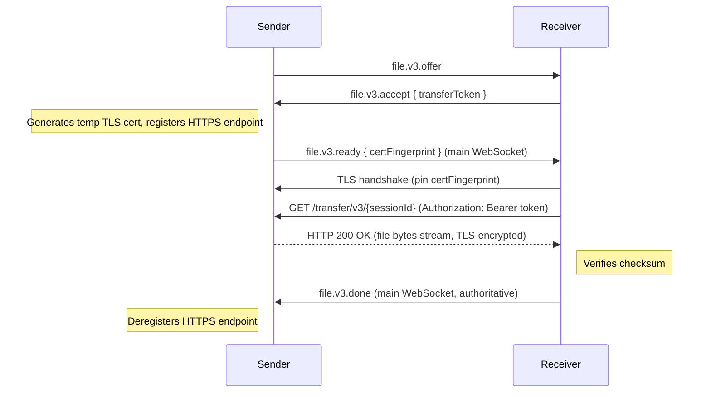
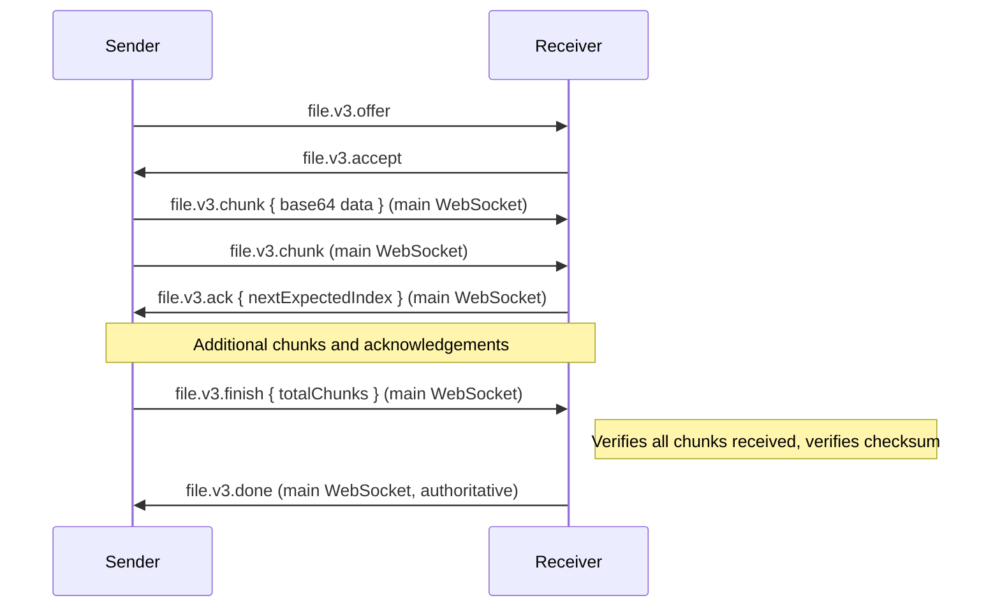

# File Transfer v3

Transfer a single file between devices using control/data plane separation with HTTP-based LAN data transfer.

## Message Type

`file.v3.*`

## Minimum Business Protocol Version

v1.15.0

When the effective Business Protocol Version (the lower of the sender's and receiver's advertised versions) is below v1.15.0, implementations MUST use the `file.v2.*` protocol instead. A sender MUST NOT send `file.v3.offer` to a peer whose effective version is below the minimum.

## Design Overview

- **Control plane**: lightweight JSON signaling on the main WebSocket (`offer / accept / reject / cancel / ready / done`)
- **Data plane (LAN)**: sender serves file via HTTPS on its P2P service port, path `GET /transfer/v3/{sessionId}`, secured with a temporary TLS certificate whose fingerprint is pinned through the AEAD-protected direct P2P session
- **Data plane (relay)**: degraded mode — `file.v3.chunk` / `file.v3.ack` / `file.v3.retransmit` / `file.v3.finish` as JSON on the main WebSocket
- **One session = one file.** To transfer multiple files, open multiple sessions.

## Security

- **sessionId** (UUIDv4): public session identifier, used to correlate messages across control and data planes.
- **transferToken** (string, generated by receiver): session-scoped bearer credential for the HTTPS data connection in LAN mode. Present in `file.v3.accept` only when the session's control plane is carried over an AEAD-protected direct P2P connection; omitted (null) in relay mode. MUST be generated using a CSPRNG, at least 256 bits (32 bytes) of entropy, encoded as base64url (unpadded). Each token MUST be unique per session and MUST NOT be reused across sessions.
- **certFingerprint** (string, generated by sender): SHA-256 fingerprint of the temporary TLS certificate used for the HTTPS data endpoint. Included in `file.v3.ready` and delivered exclusively through the AEAD-protected direct P2P connection.

### TLS Certificate Pinning

The LAN data connection uses TLS to protect file content from eavesdropping and tampering. Since no public CA is available for LAN addresses, trust is established by pinning the server certificate fingerprint through the already-authenticated direct P2P session:

1. The sender generates a temporary TLS certificate (self-signed, bound to an ephemeral key pair). The certificate MAY be generated per-session or per-application-lifecycle; per-session generation reduces the key exposure window if the certificate's private key is compromised.
2. The sender includes the certificate's SHA-256 fingerprint in `file.v3.ready`, which MUST be delivered through the AEAD-encrypted direct P2P WebSocket session. A `file.v3.ready` message carrying `certFingerprint` MUST NOT be sent or accepted over Cloud Relay, because the relay server can observe and modify unencrypted relay payloads. **Precondition**: the sender MUST only select the LAN HTTPS route when the control-plane messages for this file transfer session are bound to an established, AEAD-protected direct P2P connection. If the session's control plane is carried over Cloud Relay (i.e., no direct P2P session exists at the time `file.v3.accept` is received), the sender MUST use relay data mode regardless of LAN reachability.
3. The receiver initiates an HTTPS connection to the sender's endpoint. The receiver MUST NOT use standard CA chain validation. Instead, it MUST compute the SHA-256 hash of the server's DER-encoded certificate presented during the TLS handshake and compare it to the `certFingerprint` received on the control plane.
4. If the fingerprint matches, the TLS handshake completes and the receiver proceeds with the GET request. If it does not match, the receiver MUST abort the connection and SHOULD send `file.v3.cancel`.

This model provides:
- **Confidentiality**: TLS encrypts the entire data transfer, preventing eavesdroppers from reading file contents.
- **Authenticity**: the receiver verifies it is connected to the legitimate sender (only the sender possesses the private key matching the pinned certificate).
- **Token protection**: the `transferToken` is transmitted inside the TLS tunnel (via the `Authorization` header) and is not visible to network observers.

Mutual TLS (client certificate) is not required — in LAN HTTPS mode, the sender authenticates the receiver through the `transferToken`, which is known only to the two endpoints via the AEAD-encrypted direct P2P session. In relay mode, no `transferToken` is issued; the sender authenticates the receiver implicitly through the established business channel.

### TLS Parameters

To ensure interoperability and security, implementations MUST adhere to the following requirements:

| Parameter | Requirement |
|-----------|-------------|
| TLS version | MUST support TLS 1.3. MAY accept TLS 1.2 with ECDHE cipher suites only. MUST NOT accept TLS 1.1 or below. |
| Key exchange | MUST use ephemeral key exchange (ECDHE) for forward secrecy. Static RSA key exchange MUST NOT be used. |
| Certificate key type | MUST be ECDSA P-256 (secp256r1). This is the only mandated type to ensure cross-platform interoperability (Rust/rustls, Android/Conscrypt). RSA and Ed25519 MUST NOT be used. |
| Certificate generation | The key pair MUST be generated using a cryptographically secure random number generator (CSPRNG). |
| Certificate validity period | Not verified by the receiver (pin-based trust replaces CA/expiry validation). Implementations SHOULD set a short notional validity (e.g., 24 hours) for defense-in-depth but MUST NOT reject a certificate based on its validity period. |
| Cipher suites (TLS 1.3) | MUST support `TLS_AES_128_GCM_SHA256` and `TLS_AES_256_GCM_SHA384`. SHOULD support `TLS_CHACHA20_POLY1305_SHA256`. |
| Cipher suites (TLS 1.2) | If TLS 1.2 is accepted, MUST restrict to ECDHE-ECDSA suites: `TLS_ECDHE_ECDSA_WITH_AES_128_GCM_SHA256`, `TLS_ECDHE_ECDSA_WITH_AES_256_GCM_SHA384`, `TLS_ECDHE_ECDSA_WITH_CHACHA20_POLY1305_SHA256`. |

### Token Lifecycle (LAN HTTPS mode only)

The `transferToken` is only relevant in LAN HTTPS mode. In relay mode, no token is issued and this section does not apply.

When the receiver sends a GET request to the sender's HTTPS endpoint with `Authorization: Bearer <transferToken>`, the sender validates the token. The token remains valid for the lifetime of the session (until `file.v3.done`, `file.v3.cancel`, or timeout-triggered deregistration). However, only one active HTTP connection per session is permitted at any time — if a request arrives while another connection for the same session is still open, the sender MUST reject it with `409 Conflict`. When a connection is interrupted, the receiver MAY reconnect with the same token and a `Range` header to resume the download. The path is deregistered on completion/cancel/timeout.

## HTTPS Data Endpoint (LAN)

The sender registers an HTTPS endpoint on its P2P service port (the port advertised via mDNS `_colink._tcp.local.` SRV record). The P2P service port serves both plaintext WebSocket (`ws://`) for the existing peer protocol and TLS (`https://`) for file transfer data connections.

### Port Multiplexing and Anti-Downgrade

Implementations distinguish incoming connections by inspecting the first byte of the TCP stream:

- `0x16` (TLS ClientHello): route to TLS handler.
- Valid HTTP method first byte (`G`, `P`, `H`, `D`, `O`, `C`, `T`): route to plaintext HTTP/WebSocket handler (existing P2P protocol only).
- Any other value: MUST immediately close the connection.

Anti-downgrade rules:
- Once a connection enters the TLS branch, a TLS handshake failure (including certificate pinning mismatch) MUST result in closing that TCP connection. The implementation MUST NOT retry the same connection as plaintext HTTP.
- A `file.v3` receiver MUST always connect to the data endpoint using TLS. It MUST NOT attempt a plaintext HTTP connection to a `/transfer/v3/` path under any circumstance.
- A sender MUST NOT serve `/transfer/v3/{sessionId}` over plaintext HTTP. Requests to this path on the plaintext handler MUST be rejected with `421 Misdirected Request`.

### Request

```
GET /transfer/v3/{sessionId} HTTP/1.1
Host: <senderIp>:<senderPort>
Authorization: Bearer <transferToken>
```

(Over TLS — the receiver connects via `https://<senderIp>:<senderPort>/...` and validates the server certificate fingerprint against `certFingerprint` from `file.v3.ready`.)

Optional range request for resumption:

```
GET /transfer/v3/{sessionId} HTTP/1.1
Host: <senderIp>:<senderPort>
Authorization: Bearer <transferToken>
Range: bytes=<start>-
```

### Successful Response (full file)

```
HTTP/1.1 200 OK
Content-Type: application/octet-stream
Content-Length: <fileSize>
Accept-Ranges: bytes

<raw file bytes>
```

### Successful Response (range request)

```
HTTP/1.1 206 Partial Content
Content-Type: application/octet-stream
Content-Length: <rangeLength>
Content-Range: bytes <start>-<end>/<fileSize>

<raw file bytes from start to end>
```

### Error Responses

| Status | Condition |
|--------|-----------|
| 401 Unauthorized | `Authorization` header is missing, malformed, or token is invalid |
| 404 Not Found | Session ID not registered or already deregistered |
| 409 Conflict | Another connection for this session is already active |
| 416 Range Not Satisfiable | Range header specifies an unsatisfiable range |
| 421 Misdirected Request | Request received on plaintext handler (TLS required) |

## Checksum Algorithm Versioning

Checksum algorithm support is governed by the Business Protocol Version, identical to the rules defined in `file-transfer-v2.md`. It is not negotiated independently in `file.v3.offer`.

Before creating an offer, the sender determines the effective Business Protocol Version as the lower of its own and the receiver's advertised `businessVersion`. The versions MUST have the same major version. The sender MUST use a checksum algorithm whose minimum version is less than or equal to the effective version.

| Checksum algorithm | Minimum Business Protocol Version | Wire format | Description |
|--------------------|-----------------------------------|-------------|-------------|
| BLAKE3             | v1.2.0 | `blake3:<lowercase-hex-digest>` | BLAKE3 checksum of the complete file |
| SHA-256            | v1.2.0 | `sha256:<lowercase-hex-digest>` | SHA-256 checksum of the complete file |
| None               | v1.3.0 | `none:none` | No checksum calculation or verification |

The compatibility rules from `file-transfer-v2.md` apply without modification.

## Control Plane Messages (JSON, main WebSocket)

### file.v3.offer

```json
{
  "type": "file.v3.offer",
  "payload": {
    "sessionId": "uuid-v4",
    "fileName": "report.pdf",
    "fileSize": 1048576,
    "checksum": "blake3:abc123..."
  }
}
```

| Field     | Type   | Description                                 |
|-----------|--------|---------------------------------------------|
| sessionId | string | UUIDv4, unique transfer session ID          |
| fileName  | string | Original file name                          |
| fileSize  | number | Total size in bytes                         |
| checksum  | string | Algorithm-qualified checksum of the full file, formatted as `<algorithm>:<hash>` |

### file.v3.accept

LAN (direct P2P control plane):

```json
{
  "type": "file.v3.accept",
  "payload": {
    "sessionId": "uuid-v4",
    "transferToken": "base64url-encoded-token"
  }
}
```

Cloud Relay (no HTTPS data endpoint):

```json
{
  "type": "file.v3.accept",
  "payload": {
    "sessionId": "uuid-v4",
    "transferToken": null
  }
}
```

| Field         | Type           | Description                                      |
|---------------|----------------|--------------------------------------------------|
| sessionId     | string         | Session ID from offer                            |
| transferToken | string or null | Session-scoped bearer credential for the HTTPS data connection. MUST be present when the session's control plane is carried over an AEAD-protected direct P2P connection (LAN HTTPS may be selected). MUST be `null` or omitted when the control plane is carried over Cloud Relay (only relay data mode is possible, and the token would serve no purpose). |

After receiving `accept`, the sender determines the route independently based on its own LAN discovery state and the current control-plane transport. The sender selects LAN HTTPS only when both conditions are met: (1) the receiver is LAN-reachable, and (2) the control-plane messages for this session are carried over an established AEAD-protected direct P2P connection. If either condition is not met, the sender falls back to relay mode (JSON chunks on the main WebSocket). If a LAN HTTPS connection attempt fails (receiver cannot connect or certificate pinning fails), the sender sends `file.v3.cancel` — there is no automatic fallback from LAN to relay within the same session.

### file.v3.reject

```json
{
  "type": "file.v3.reject",
  "payload": {
    "sessionId": "uuid-v4",
    "reason": "colink:transfer.storage_full.v1",
    "message": "Not enough storage space on receiver",
    "details": { "available": 1048576, "required": 5242880 }
  }
}
```

| Field | Type | Required | Description |
|-------|------|----------|-------------|
| sessionId | string | Yes | Session ID from offer |
| reason | string | Yes | Rejection reason |
| message | string | Yes | Human-readable description for logging/debugging |
| details | object | No | Extensible structured metadata. Receivers MUST ignore unknown keys |

Well-known reasons:

| Reason | Description |
|--------|-------------|
| `colink:transfer.storage_full.v1` | Receiver storage space insufficient |
| `colink:transfer.user_rejected.v1` | User rejected the file |
| `colink:transfer.generic.v1` | Generic transfer failure not covered by a specific reason |

### file.v3.cancel

Either side can cancel at any time:

```json
{
  "type": "file.v3.cancel",
  "payload": {
    "sessionId": "uuid-v4",
    "reason": "colink:transfer.user_cancelled.v1",
    "message": "User cancelled the transfer"
  }
}
```

| Field | Type | Required | Description |
|-------|------|----------|-------------|
| sessionId | string | Yes | Session ID from offer |
| reason | string | Yes | Cancellation reason |
| message | string | Yes | Human-readable description for logging/debugging |
| details | object | No | Extensible structured metadata. Receivers MUST ignore unknown keys |

Well-known reasons:

| Reason | Description |
|--------|-------------|
| `colink:transfer.user_cancelled.v1` | User cancelled the transfer |
| `colink:transfer.generic.v1` | Generic transfer failure not covered by a specific reason |

### file.v3.ready

Sent by sender after successfully registering the HTTPS data endpoint:

```json
{
  "type": "file.v3.ready",
  "payload": {
    "sessionId": "uuid-v4",
    "certFingerprint": "sha256:a1b2c3d4e5f6..."
  }
}
```

| Field           | Type   | Description                                                        |
|-----------------|--------|--------------------------------------------------------------------|
| sessionId       | string | Session ID from offer                                              |
| certFingerprint | string | SHA-256 fingerprint of the sender's TLS certificate, formatted as `sha256:<lowercase-hex-digest>`. The digest is computed over the DER-encoded certificate. |

The receiver MUST use `certFingerprint` to validate the TLS server certificate when connecting to the HTTPS data endpoint. The receiver begins the HTTPS GET request after receiving this message.

### file.v3.chunk (relay mode only)

Sent on the main WebSocket as JSON in relay mode:

```json
{
  "type": "file.v3.chunk",
  "payload": {
    "sessionId": "uuid-v4",
    "chunkIndex": 0,
    "data": "base64encodeddata..."
  }
}
```

| Field      | Type   | Description                    |
|------------|--------|--------------------------------|
| sessionId  | string | Session ID                     |
| chunkIndex | number | Chunk sequence number (0-based)|
| data       | string | Base64 encoded chunk bytes     |

### file.v3.ack (relay mode only)

```json
{
  "type": "file.v3.ack",
  "payload": {
    "sessionId": "uuid-v4",
    "nextExpectedIndex": 4
  }
}
```

### file.v3.retransmit (relay mode only)

Sent by receiver when a gap persists beyond the retransmit timeout:

```json
{
  "type": "file.v3.retransmit",
  "payload": {
    "sessionId": "uuid-v4",
    "chunkIndex": 2
  }
}
```

| Field      | Type   | Description                          |
|------------|--------|--------------------------------------|
| sessionId  | string | Session ID                           |
| chunkIndex | number | Index of the chunk to retransmit     |

### file.v3.finish (relay mode only)

Sent by sender after all chunks have been transmitted:

```json
{
  "type": "file.v3.finish",
  "payload": {
    "sessionId": "uuid-v4",
    "totalChunks": 16
  }
}
```

| Field       | Type   | Description                              |
|-------------|--------|------------------------------------------|
| sessionId   | string | Session ID                               |
| totalChunks | number | Total number of chunks sent (0-based index of last chunk + 1) |

Upon receiving `file.v3.finish`, the receiver confirms that all chunks `0` through `totalChunks - 1` have been received (requesting retransmission for any gaps), reassembles the file, verifies that the total size matches `fileSize` from the offer, verifies the checksum, and sends `file.v3.done`. `file.v3.finish` does NOT mean the transfer is complete — the receiver MUST still verify and send `file.v3.done` on the control plane.

After sending `file.v3.finish`, the sender MUST retain session state and source data, and MUST continue responding to `file.v3.ack` and `file.v3.retransmit` messages, until it receives `file.v3.done`, `file.v3.cancel`, or the idle timeout expires. The sender MUST NOT release resources or deregister the session before one of these conditions is met.

### file.v3.done

Sent by receiver on the **control plane (main WebSocket)** after the file is fully received and checksum is verified. This is the single authoritative completion signal.

Success:

```json
{
  "type": "file.v3.done",
  "payload": { "sessionId": "uuid-v4", "success": true }
}
```

Failure:

```json
{
  "type": "file.v3.done",
  "payload": {
    "sessionId": "uuid-v4",
    "success": false,
    "reason": "colink:transfer.checksum_mismatch.v1",
    "message": "File checksum verification failed",
    "details": { "expected": "blake3:abc123...", "actual": "blake3:def456..." }
  }
}
```

| Field | Type | Required | Description |
|-------|------|----------|-------------|
| sessionId | string | Yes | Session ID from offer |
| success | boolean | Yes | Whether the transfer completed successfully |
| reason | string | When `success: false` | Failure reason |
| message | string | When `success: false` | Human-readable description for logging/debugging |
| details | object | No | Extensible structured metadata. Receivers MUST ignore unknown keys |

Well-known reasons:

| Reason | Description |
|--------|-------------|
| `colink:transfer.checksum_mismatch.v1` | File checksum verification failed |
| `colink:transfer.generic.v1` | Generic transfer failure not covered by a specific reason |

After `file.v3.done` is sent:
- **LAN mode**: the HTTPS endpoint path is deregistered.
- **Relay mode**: no data-plane cleanup required.

## Flow

### LAN (HTTPS data transfer)



### Cloud Relay (degraded mode)



## Reliable Transfer Mechanism (relay mode only)

The relay mode implements the same reliable transfer logic as `file.v2`:

- **Cumulative ACK**: receiver sends ACK with `nextExpectedIndex` every N chunks or every Tms, whichever comes first
- **Reorder buffer**: receiver buffers up to `windowSize` out-of-order chunks, writes sequentially to disk
- **Retransmit**: receiver requests retransmission of a specific chunk index if a gap persists for 2s (`file.v3.retransmit` JSON message)
- **Send window**: sender may have at most `windowSize` unacknowledged chunks in flight (relay default: 4)
- **Idle timeout**: implementation-defined; when no activity exceeds the local timeout, the transfer is marked failed

The LAN HTTPS mode does not require application-layer reliable transfer — TCP provides ordered, reliable delivery natively.

## Notes

`fs.v1.download` and `fs.v1.upload` may initiate a standard `file.v3.offer` flow when the effective Business Protocol Version is ≥ v1.15.0. The filesystem protocol defines their outer-envelope `correlationId` semantics; `file.v3` does not carry or define a remote filesystem path.

- Offer expires after 60s with no response
- One session = one file; to transfer multiple files, use multiple sessions
- After `file.v3.ready`, if no HTTPS GET request arrives within an implementation-defined timeout, the sender SHOULD deregister the endpoint and send `file.v3.cancel`
