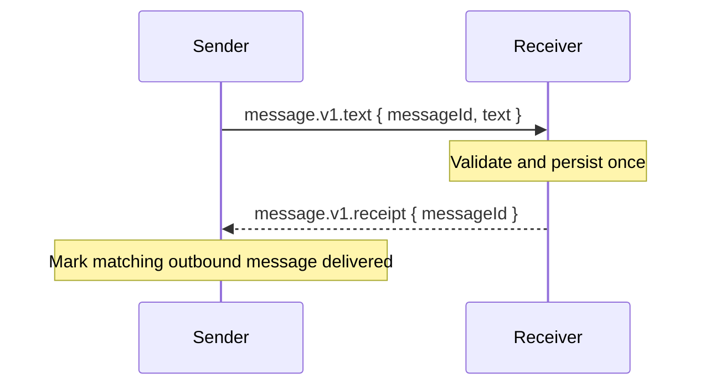

# Text Message

Send text messages between devices. Version 1.14.0 adds an optional delivery receipt for peers that support it.

## Minimum Business Protocol Version

| Capability | Minimum version |
|------------|-----------------|
| `message.v1.text` | 1.0.0 |
| `message.v1.receipt` | 1.14.0 |

## Text Message

### Message Type

`message.v1.text`

### Payload

```json
{
  "type": "message.v1.text",
  "payload": {
    "messageId": "88a3c4d5-e6f7-8901-abcd-ef0123456789",
    "text": "Hello from my phone"
  }
}
```

| Field     | Type   | Description              |
|-----------|--------|--------------------------|
| messageId | string | Unique message ID (UUID v4) |
| text      | string | Message content          |

`messageId` identifies one logical text message across LAN and Cloud Relay. A sender that retransmits the same logical message MUST reuse its original `messageId` and text.

## Delivery Receipt

### Message Type

`message.v1.receipt`

### Payload

```json
{
  "type": "message.v1.receipt",
  "payload": {
    "messageId": "88a3c4d5-e6f7-8901-abcd-ef0123456789"
  }
}
```

| Field     | Type   | Description |
|-----------|--------|-------------|
| messageId | string | The `messageId` from the received `message.v1.text` |

The receipt is a Business Protocol message. It is sent as a normal reply over an available trusted route; it does not rely on the enclosing LAN or Cloud Relay envelope ID.

### Receipt Semantics

1. A receiver validates the text-message payload and persists the message before emitting a receipt.
2. The receipt means the receiving client has accepted and durably recorded the text message. It does not mean the user has read it or that a notification was displayed.
3. A receiver deduplicates incoming text messages by `messageId`. A duplicate does not create another conversation entry or notification, but the receiver MUST emit another receipt.
4. A sender marks an outbound message as delivered only after it receives a matching receipt from the intended peer. A receipt from another peer, or for a message that is not a local outbound message to that peer, MUST be ignored.
5. Receipts are not acknowledged. They do not cause another receipt or response.

### Timeout and Retransmission

Absence of a receipt does not prove that a text message was not received: the original message or its receipt may have been lost, and Cloud Relay has no offline queue. The protocol therefore does not define automatic retransmission, an offline outbox, or a delivery timeout. A client may present an outbound message as sent but unconfirmed according to its local product policy.

If a future client retransmits a text message, it reuses the same `messageId`. The receiver's deduplication and repeated receipt make such retransmission idempotent at the conversation level.

### Flow



## Compatibility

`message.v1.receipt` is introduced in Business Protocol Version 1.14.0. A receiver sends a receipt for every accepted text message without checking the peer's advertised Business Protocol Version. Older peers ignore the unknown message type under the standard forward-compatibility rule.

When the peer is older, has no advertised Business Protocol Version, or has an incompatible major version:

- The sender continues to send `message.v1.text` using the existing fire-and-forget behavior.
- The sender does not wait for a receipt and does not infer a delivery failure from its absence.
- A newer receiver still sends a receipt after accepting the text message.
- Older peers silently ignore `message.v1.receipt` under the standard forward-compatibility rule.

## General Notes

- Max text length: 10,000 characters.
